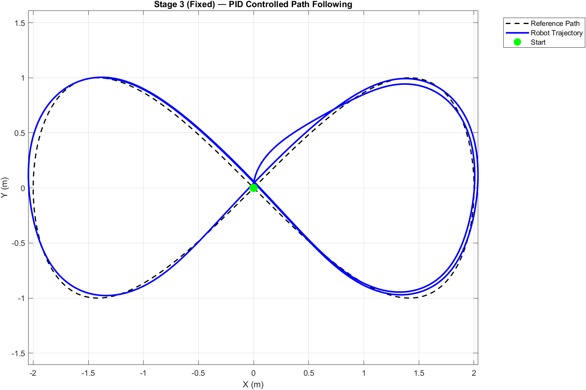
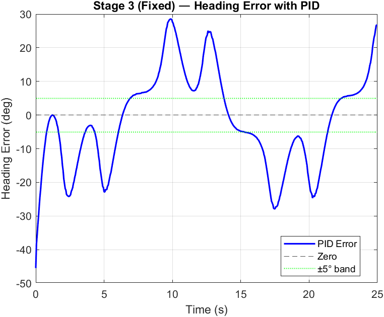
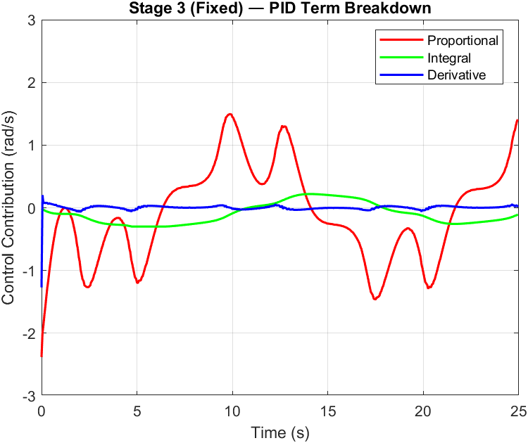
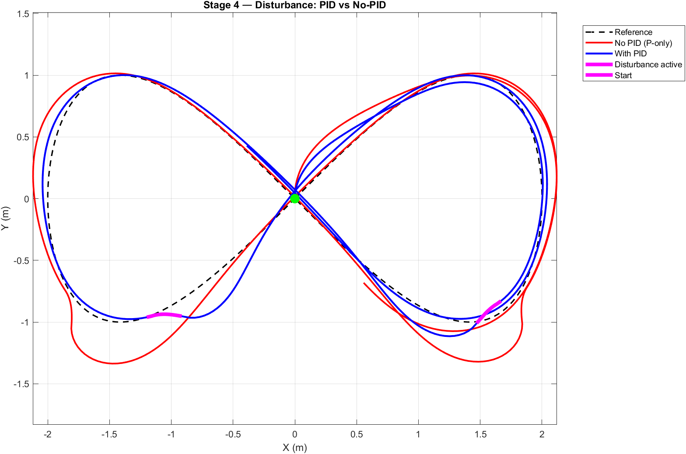
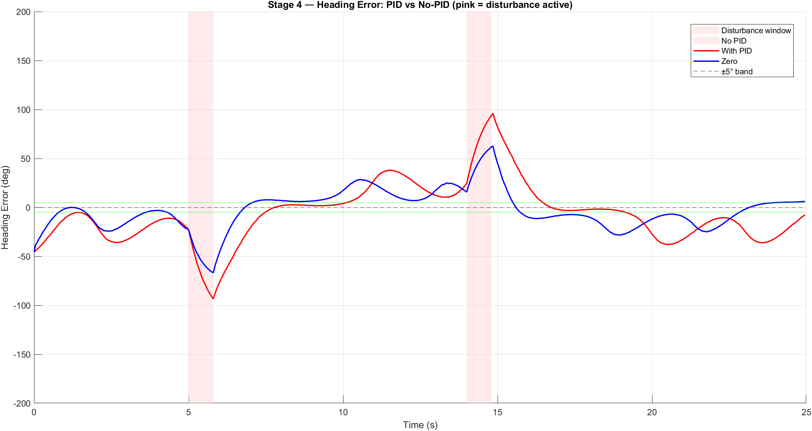
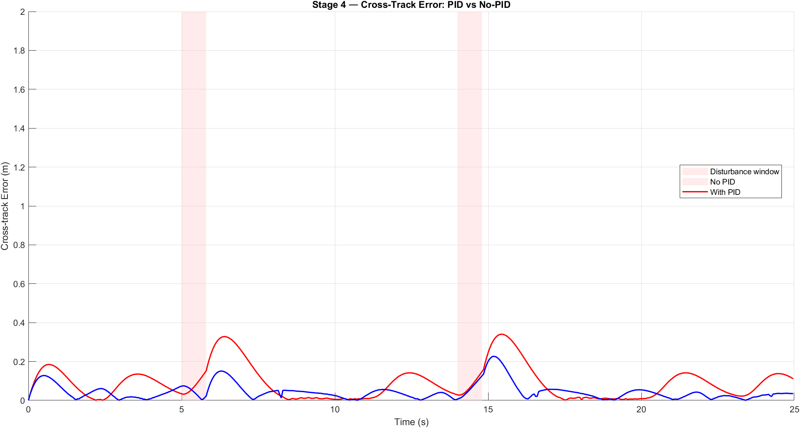
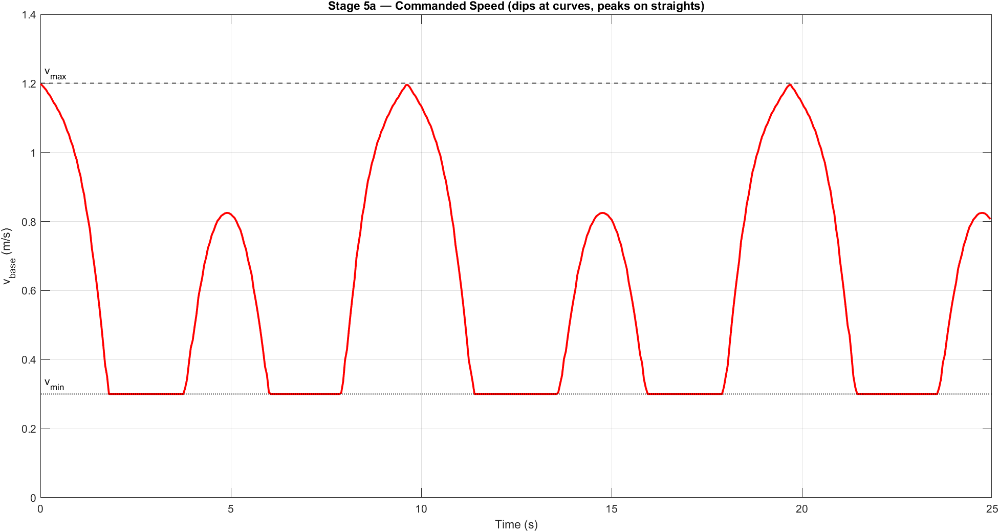
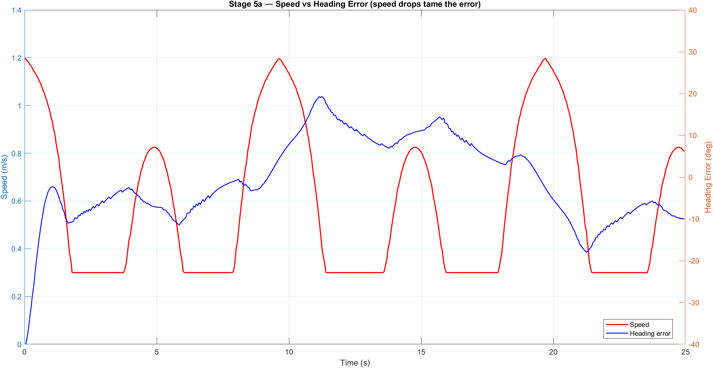
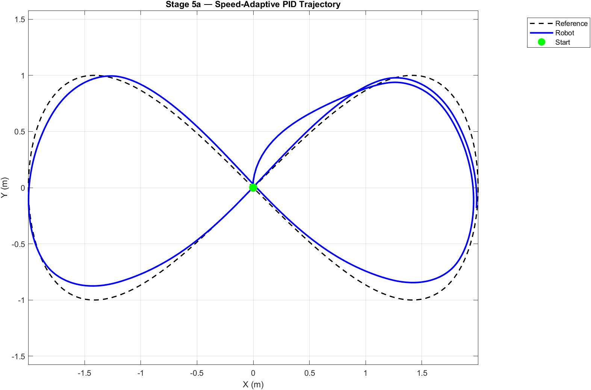
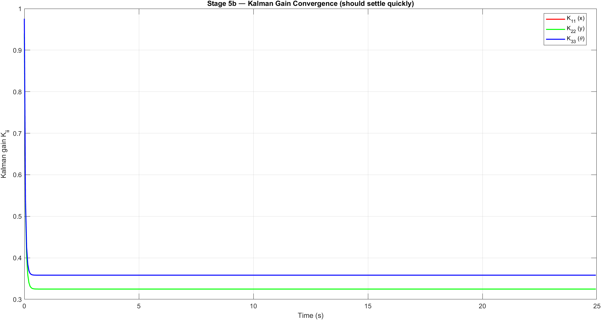

# Differential Drive Robot Simulation
### MATLAB simulation of a mobile robot: from kinematics to PID control, disturbance rejection, and EKF state estimation

---

## Overview

This project simulates a differential drive robot navigating a figure-8 path through five progressive stages, each adding a layer of control or estimation complexity. Built entirely from scratch in MATLAB using Euler integration and classical control theory — no toolboxes required.

**Keywords:** PID Control · Kalman Filter · Sensor Fusion · Path Following · Pure Pursuit · Differential Drive · Mobile Robotics · MATLAB Simulation · Anti-Windup · State Estimation

---

## Simulation Stages

### Stage 1 — Kinematics
Open-loop forward simulation with fixed wheel speeds. Establishes the unicycle kinematic model used throughout the project.

```
v = (vR + vL) / 2
ω = (vR - vL) / L
```

### Stage 2 — Pure Pursuit Path Following
A parametric figure-8 reference path is defined. A lookahead-based Pure Pursuit controller computes the desired heading and drives the robot along the path using proportional steering.

### Stage 3 — PID Heading Controller
Replaces the P-only steering with a full **PID controller** with **integral anti-windup**. A forward-only sliding-window path indexer prevents backward jumps on the closed loop.

| Parameter | Value |
|-----------|-------|
| Kp | 3.0 |
| Ki | 0.3 |
| Kd | 0.08 |
| Anti-windup limit | ±1.0 rad |
| Lookahead distance | 0.5 m |

### Stage 4 — Disturbance Injection & Recovery
Two asymmetric wheel-speed disturbances are injected mid-run (simulating wheel slip). PID and P-only controllers are run in parallel. Metrics compared: trajectory deviation, heading error, and cross-track error (CTE).

| Disturbance | Time | Effect |
|-------------|------|--------|
| #1 | 5.0 – 5.8 s | Left wheel scaled to 20% |
| #2 | 14.0 – 14.8 s | Right wheel scaled to 20% |

**Result:** PID recovers within ~2s; P-only accumulates persistent drift.

### Stage 5a — Speed-Adaptive PID
Path curvature is pre-computed using the Frenet formula. Forward speed is modulated by curvature: full speed on straights, slowed on tight bends. This reduces heading error at curves without retuning gains.

```
v_base = v_max − (v_max − v_min) × (κ / κ_max)
```

| Parameter | Value |
|-----------|-------|
| v_max | 1.2 m/s |
| v_min | 0.3 m/s |
| κ_max (cap) | 1.2 m⁻¹ |

### Stage 5b — Extended Kalman Filter (EKF)
Gaussian sensor noise is added to the true pose at each step. An **EKF** fuses the noisy measurement with the kinematic motion model (odometry) to produce a cleaner state estimate. The PID controller drives using the EKF estimate throughout.

| Parameter | Value |
|-----------|-------|
| σ_xy (position noise) | 0.09 m |
| σ_θ (heading noise) | 0.055 rad |
| Process noise Q | diag(0.002, 0.002, 0.0008) |

**Result:** EKF reduces position RMS error by ~30% vs raw sensor.

---

## Results

### Stage 3 — PID Path Following




### Stage 4 — Disturbance: PID vs P-only




### Stage 5a — Speed-Adaptive PID



### Stage 5b — EKF State Estimation




---

## Repository Structure

```
DDRobot-Simulation/
├── stages/
│   ├── Stage1_Kinematics.m
│   ├── Stage2_PurePursuit.m
│   ├── Stage3_PID.m
│   ├── Stage4_Disturbance.m
│   ├── Stage5a_SpeedAdaptive.m
│   └── Stage5b_EKF.m
├── results/           ← exported plot PNGs
├── DDRobot_PID_final.mlx   ← original MATLAB Live Script (all stages)
└── README.md
```

---

## How to Run

1. Open MATLAB R2023b or later (R2022b minimum for `yline` named arguments).
2. Run each stage file independently — each calls `clc; clear; close all` at the top.
3. Alternatively, open `DDRobot_PID_final.mlx` in MATLAB Live Editor to run all stages sequentially with inline output.

No toolboxes are required. All code uses base MATLAB only.

---

## Robot Model

| Parameter | Value |
|-----------|-------|
| Wheel baseline L | 0.3 m |
| Time step dt | 0.05 s |
| Simulation time T | 10 – 25 s (varies by stage) |
| Reference path | Figure-8: x = 2sin(t), y = sin(2t) |

---

## Skills Demonstrated

- Unicycle / differential drive kinematic modelling
- Pure Pursuit path-following algorithm
- PID control design with anti-windup
- Disturbance injection and controller robustness analysis
- Curvature-based speed scheduling
- Extended Kalman Filter (EKF) for odometry + sensor fusion
- Cross-track error and heading error metrics

---

*IIIT Bhagalpur — Personal simulation project, 2024–25*
